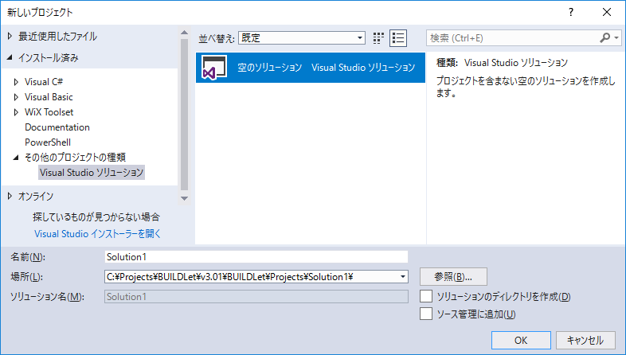
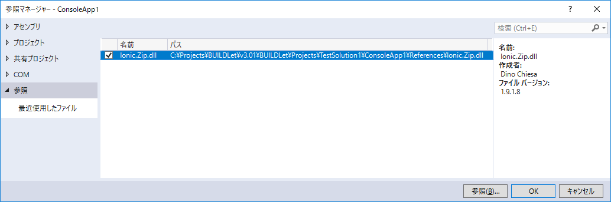

Build Configuration Tool
========================

概要
----
Visual Studio ソリューションの操作・設定をサポートするツールを提供します。


インストール方法
----------------
BuildConfig.ps1 をソリューション ディレクトリのひとつ上の階層に配置してください。  


アンインストール方法
--------------------
BuildConfig.ps1 を削除してください。


動作環境
--------
以下の環境で動作を確認しています。
 - Windows 10 Pro, Version 1803 x64 日本語
 - Visual Studio Community 2017 (Version 15.9.3)
 - PowerShell 5.1.17134.407


使用方法
--------
以下の操作・設定をサポートします。  
詳細はヘルプを参照してください。

1. 新しいソリューション ディレクトリを作成します。  
   指定された名前のソリューション ディレクトリを作成し、その直下に次のディレクトリを作成します。

    - Licenses
    - Packages
    - Properties
    - Readme
    - Resources
    - TestData
    - TestResults

   Licenses ディレクトリに LICENSE ファイルを作成します。  
   Properties ディレクトリに AssemblyInfoBase ファイル ('AssemblyInfoBase.cs') を作成します。

   ```powershell:sample
   .\BuildConfig.ps1 -New -SolutionName TestSolution
   ```

   上記コマンドを実行した後、以下の設定で「空のソリューション」を作成してください。

   - 名前: 作成したソリューション ディレクトリの名前
   - 場所: 作成したソリューション ディレクトリのパス
   - ソリューションのディレクトリを作成: オフ

   

   再頒布可能ファイルは、以下のように指定してください。
   
   1. プロジェクト ディレクトリの下に Redistributables ディレクトリを作成する。
   2. Redistributables ディレクトリの下に、ソリューション構成 (Debug および Release) のディレクトリを作成する。
   3. ソリューション構成に応じた再頒布可能ファイルを配置する。

   参照ファイルは、以下のように指定してください。

   1. 再頒布可能ファイルを配置したディレクトリに、ソリューション構成に応じた参照ファイル (コピー元) を配置する。
   2. プロジェクト ディレクトリの下に References ディレクトリを作成する。
   2. 参照ファイルを配置する。
   3. Visual Studio の [参照の追加] から参照ファイルを指定する。

   

   このように設定することで、ソリューション構成に応じたファイルを参照できるようになります。

2. ソリューション ディレクトリをクリーニングします。

   ```powershell:sample
   .\BuildConfig.ps1 -Clean -SolutionName TestSolution
   ```

3. ビルド後イベント (PostBuildEvent) のコマンドラインを指定します。

   ```powershell:sample
   PowerShell.exe -File $(SolutionDir)..\BuildConfig.ps1 -PostBuildEvent -SolutionName $(SolutionName) -ProjectName $(ProjectName) -ConfigurationName $(ConfigurationName) -TargetFileNames $(TargetFileName),redist1.dll,redist2.dll,ref.dll
   ```

   この例では、出力ファイルに $(TargetFileName)、redist1.dll、redist2.dll および ref.dll が指定されています。

4. ビルド前イベント (PreBuildEvent) のコマンドラインを指定します。

   ```powershell:sample
   PowerShell.exe -File $(SolutionDir)..\BuildConfig.ps1 -PreBuildEvent -SolutionName $(SolutionName) -ProjectName $(ProjectName) -ConfigurationName $(ConfigurationName) -RedistFileNames redist1.dll,redist2.dll -ReferenceFileNames ref.dll
   ```

   この例では、再頒布可能ファイルに redist1.dll および redist2.dll が、参照ファイルに ref.dll が指定されています。

ライセンス
----------
このソフトウェアは MIT ライセンスの下で配布されます。  
[LICENCE](/LICENSE "LICENSE") を参照してください。


変更履歴
--------
### Version 3.0.1.0
**2018/12/01**  
1st リリース
