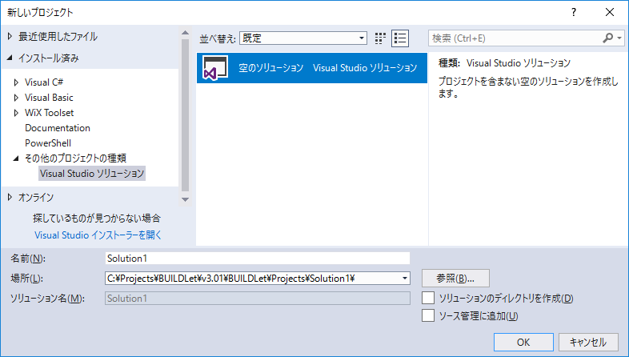
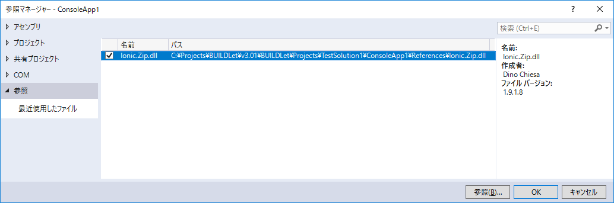

Build Configuration Tool
========================

概要
----

Visual Studio ソリューションの操作・設定をサポートするツールを提供します。

インストール方法
----------------

BuildConfig.ps1 および EnvDTE.psm1 をソリューション ディレクトリのひとつ上の階層に配置してください。  

アンインストール方法
--------------------

BuildConfig.ps1 および EnvDTE.psm1 を削除してください。

動作環境
--------

以下の環境で動作を確認しています。

- Windows 10 Pro, Version 1803 x64 日本語
- Visual Studio Community 2017
- PowerShell 5.1

使用方法
--------

以下の操作・設定をサポートします。  
詳細はヘルプを参照してください。

1. 新しいソリューション ディレクトリを作成するには、以下のコマンドを入力します。  

       .\BuildConfig.ps1 -New -SolutionName TestSolution

   指定された名前のソリューション ディレクトリが作成され、その直下に次のディレクトリが作成されます。

    - .images
    - Licenses
    - Packages
    - Properties
    - Readme
    - Resources
    - TestData
    - TestResults

   Licenses ディレクトリに LICENSE ファイルが作成されます。  
   Properties ディレクトリに AssemblyInfoBase ファイル ('AssemblyInfoBase.cs') が作成されます。

   上記コマンドを実行した後、以下の設定で「空のソリューション」を作成してください。

   

   - 名前: 作成したソリューション ディレクトリの名前
   - 場所: 作成したソリューション ディレクトリのパス
   - ソリューションのディレクトリを作成: オフ

   参照ファイルは、以下のように指定してください。

   1. プロジェクト ディレクトリの下に Redistributables ディレクトリ および References ディレクトリを作成します。
   2. Redistributables ディレクトリの下に、ソリューション構成 (Debug および Release) のディレクトリを作成し、ソリューション構成に応じた参照ファイルを配置します。
   3. 現在のソリューション構成 (Debug あるいは Release) に応じた参照ファイルを Redistributables ディレクトリから References ディレクトリにコピーします。
   4. Visual Studio の [参照の追加] から参照ファイルを指定します。

   

   このように設定することで、ビルド時にソリューション構成に応じたファイルを参照できるようになります。  
   NuGet パッケージが用意されておらず、ソリューション構成 (Debug あるいは Release) に応じて参照ファイルを変えたい場合などに使用できます。

2. ソリューション ディレクトリをクリーニングするには、以下のコマンドを入力します。

       .\BuildConfig.ps1 -Clean -SolutionName TestSolution

3. ビルド後イベント (PostBuildEvent) のコマンドラインを指定します。

       PowerShell.exe -File $(SolutionDir)..\BuildConfig.ps1 -PostBuildEvent -SolutionName $(SolutionName) -ProjectName $(ProjectName) -ConfigurationName $(ConfigurationName) -TargetFileNames $(TargetFileName),$(TargetName).xml

   この例では、出力ファイルに $(TargetFileName) および $(TargetName).xml を指定しています。  
   複数ファイルの場合は、コンマ区切りで指定してください。  
   PowerShell.exe がひとつの引数として解釈できるように、スペースは含めないでください。

4. ビルド前イベント (PreBuildEvent) のコマンドラインを指定します。

       PowerShell.exe -File $(SolutionDir)..\BuildConfig.ps1 -PreBuildEvent -SolutionName $(SolutionName) -ProjectName $(ProjectName) -ConfigurationName $(ConfigurationName) -ReferenceFileNames redist1.dll,redist2.dll,redist3.dll

   この例では、参照ファイルに redist1.dll, redist2.dll および redist3.dll を指定しています。  
   複数ファイルの場合は、コンマ区切りで指定してください。  
   PowerShell.exe がひとつの引数として解釈できるように、スペースは含めないでください。

   ConfigurationName パラメーターを省略して、ソリューション構成を自動的に取得するためには、任意のソリューションで EnvDTE (EnvDTE.8.0.2) NuGet パッケージがインストールされている必要があります。このとき、複数の Visual Studio が起動している場合は、最初に起動した Visual Studio のソリューション構成を取得します。

ライセンス
----------

このソフトウェアは MIT ライセンスの下で配布されます。  
[LICENCE](/LICENSE "LICENSE") を参照してください。

変更履歴
--------

### Version 1.0.3.0 (2019/02/17)

- PowerShell モジュール用のオプションを追加しました。
- 構成ファイルとして EnvDTE.psm1 が追加されました。

### Version 1.0.2.0 (2019/02/11)

- マイナーバージョンアップ

### Version 1.0.1.0 (2018/12/12)

- マイナーバージョンアップ

### Version 1.0.0.0 (2018/12/09)

- 1st リリース
